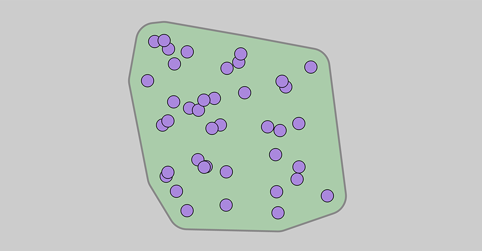

Smooth Convex Hull
====================================================================================================

These are two examples of rendering a region around a set of 2D points. I use D3 to get the convex
hull, and then show two different methods to generate a blob around them.

Rounded Hull
-------------

_Click on image to view an animated demonstration_

This technique uses `d3.polygonHull`, then offsets each segment of the resulting polygon outwards,
bridging the gaps with circular arcs. One could also envision using Bézier curves to get a blob with
no straight segments.

Smooth Hull
------------

_Click on image to view an animated demonstration_

This approach renders a loose enclosing hull around a scattered set of points using a rounded
Catmull-Rom curve. The strict convex hull is offset by a specified amount, and then interpolated
with a closed curve.
